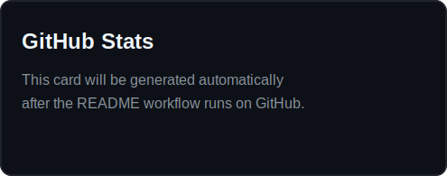
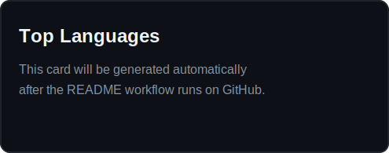

[English](README.md) | **Español**

<h1 align="center">Hola, soy Miguel Linares</h1>

  Full Stack Developer enfocado en construir aplicaciones web modernas y soluciones listas para la nube.

  <a href="mailto:malg20012002@gmail.com">Correo</a> •
  <a href="https://www.linkedin.com/in/miguel-linares-gamez/">LinkedIn</a>

  

## Sobre Mi

- Desarrollo aplicaciones web con React, Node.js, NestJS, PostgreSQL y TypeScript.
- Disfruto trabajar en equipos colaborativos, con buena arquitectura y aprendizaje continuo.
- Actualmente estoy abierto a oportunidades donde pueda seguir creciendo como full stack developer.

## Stack Tecnologico

## Estadisticas de GitHub

  
  

## Contacto

- Correo: `malg20012002@gmail.com`
- LinkedIn: <a href="https://www.linkedin.com/in/miguel-linares-gamez/">miguel-linares-gamez</a>
